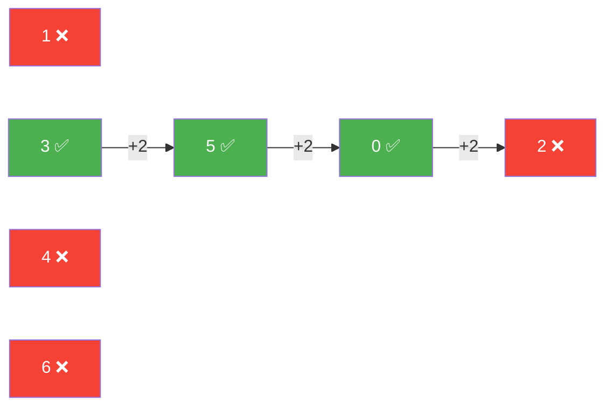
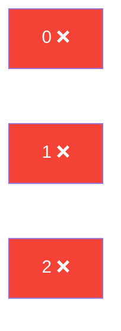
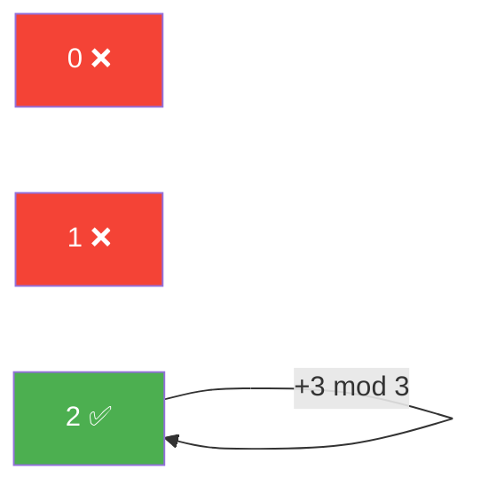
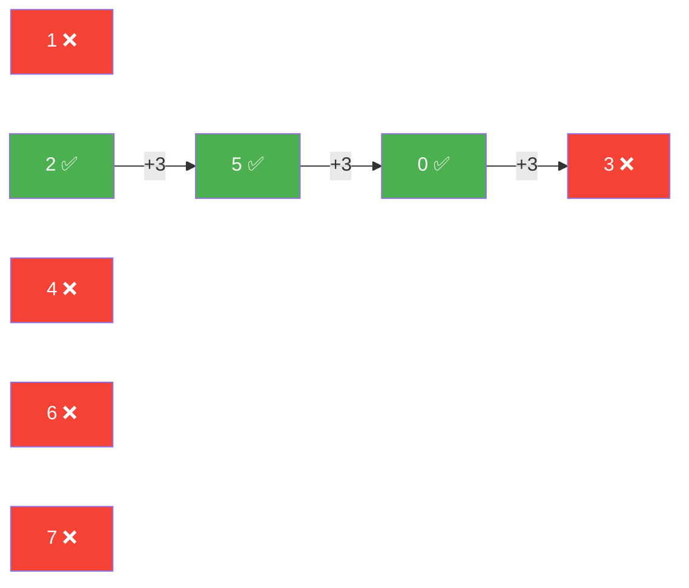
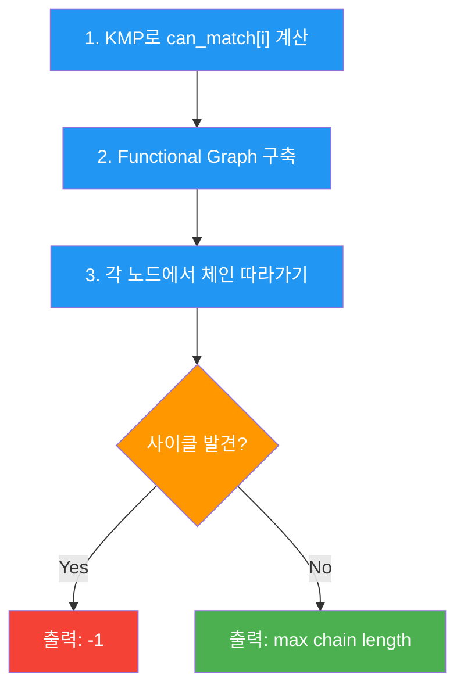

# ABC135 F - Functional Graph 시각화

## 핵심 구조

> [!IMPORTANT]
> 노드 = `s`의 각 시작 위치 (`0 ~ |s|-1`)
> 간선 = `t`가 매칭되면 `i → (i + |t|) % |s|`
> 각 노드는 **outdegree ≤ 1** (functional graph)

---

## 예제 1: `s = "abcabab"`, `t = "ab"` → 답: **3**

`|s| = 7`, `|t| = 2`

각 시작점에서 `t = "ab"` 매칭 여부:

| 시작점 i | s^∞[i..i+1] | 매칭? | 다음 = (i+2)%7 |
|---|---|---|---|
| 0 | `ab` | ✅ | 2 |
| 1 | `bc` | ❌ | - |
| 2 | `ca` | ❌ | - |
| 3 | `ab` | ✅ | 5 |
| 4 | `ba` | ❌ | - |
| 5 | `ab` | ✅ | 0 |
| 6 | `ba` | ❌ | - |

**최장 경로**: `3 → 5 → 0 → 2(❌)` = **3개** 매칭 후 끊김 → 답 `3`

---

## 예제 2: `s = "aa"`, `t = "aaaaaaa"` → 답: **-1**

`|s| = 2`, `|t| = 7`

| 시작점 i | s^∞[i..i+6] | 매칭? | 다음 = (i+7)%2 |
|---|---|---|---|
| 0 | `aaaaaaa` | ✅ | 1 |
| 1 | `aaaaaaa` | ✅ | 0 |

**사이클 발견**: `0 → 1 → 0 → ...` 무한 반복 → 답 `-1`

---

## 예제 3: `s = "aba"`, `t = "baaab"` → 답: **0**

`|s| = 3`, `|t| = 5`

| 시작점 i | s^∞[i..i+4] | 매칭? |
|---|---|---|
| 0 | `abaab` | ❌ |
| 1 | `baaba` | ❌ |
| 2 | `aabaa` | ❌ |

**간선 없음** → 어디서도 `t` 매칭 불가 → 답 `0`

---

## 예제 4: `s = "cbb"`, `t = "bcb"` → 답: **-1**

`|s| = 3`, `|t| = 3`

| 시작점 i | s^∞[i..i+2] | 매칭? | 다음 = (i+3)%3 |
|---|---|---|---|
| 0 | `cbb` | ❌ | - |
| 1 | `bbc` | ❌ | - |
| 2 | `bcb` | ✅ | 2 |

**자기 자신으로 돌아오는 사이클** → 답 `-1`

---

## 예제 5: `s = "bababbab"`, `t = "bab"` → 답: **3**

`|s| = 8`, `|t| = 3`

| 시작점 i | s^∞[i..i+2] | 매칭? | 다음 = (i+3)%8 |
|---|---|---|---|
| 0 | `bab` | ✅ | 3 |
| 1 | `aba` | ❌ | - |
| 2 | `bab` | ✅ | 5 |
| 3 | `abb` | ❌ | - |
| 4 | `bba` | ❌ | - |
| 5 | `bab` | ✅ | 0 |
| 6 | `abb` | ❌ | - |
| 7 | `bba` | ❌ | - |

**최장 경로**: `2 → 5 → 0 → 3(❌)` = **3개** 매칭 → 답 `3`

> [!NOTE]
> 이 케이스가 기존 `j=0` 리셋 방식에서 놓쳤던 반례입니다.
> `j=0` 리셋은 시작점 0에서만 탐색하여 `0 → 3(❌)` = 1개만 찾았지만,
> 그래프에서는 시작점 2가 더 긴 체인을 가지는 것이 한눈에 보입니다.

---

## 알고리즘 정리

